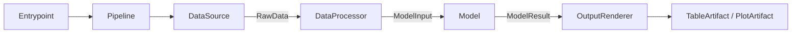

# Model Architecture

An opinionated but framework-neutral baseline for building data-driven models with Python 3.13 and `uv`.

It works for business-rule engines, statistical models, optimization models, forecasting pipelines, simulations, and machine-learning inference. The core package does not depend on a dataframe library, plotting library, database client, or web framework.

## Runtime flow



`Pipeline` is the only object that knows the full workflow:

1. `DataSource.retrieve()` performs external I/O and returns raw data.
2. `DataProcessor.process()` validates and transforms raw data into model-ready input.
3. `Model.run()` applies business logic and returns a typed result.
4. Each `OutputRenderer.render()` turns the model result into an artifact.

The `Model` never retrieves data or renders output. This makes business logic deterministic and easy to test.

## Layers

Every contract is a single-method `typing.Protocol`, and one rule decides where it lives:

> If it touches the outside world, it is a **port**. Otherwise it is **domain**.

| Package | Role | Holds |
| --- | --- | --- |
| `domain/` | What the application computes | `DataProcessor`, `Model`, errors |
| `ports/` | How it connects to the world | `DataSource`, `OutputRenderer` |
| `adapters/` | Replaceable implementations of ports | `InMemoryDataSource`, `TableRenderer`, `PlotRenderer` |
| `application/` | Orchestration | `Pipeline`, `PipelineResult` |
| `entrypoints/` | Delivery boundaries | CLI, API, worker, scheduler |
| `artifacts.py` | Shared presentation values | `TableArtifact`, `PlotArtifact`, `PlotSeries` |
| `bootstrap.py` | Composition root | Builds and injects collaborators |

Artifacts sit at the top level rather than inside `adapters/` because they are the stable currency every layer passes around, not a replaceable implementation detail.

## Project structure

```text
src/model_architecture/
├── domain/             # DataProcessor and Model contracts, errors
├── ports/              # DataSource and OutputRenderer contracts
├── adapters/           # Replaceable data source and renderer implementations
├── application/        # Pipeline orchestration
├── entrypoints/        # CLI, API, worker, or scheduler boundaries
├── examples/           # Executable reference implementation
├── artifacts.py        # Library-neutral tables and plots
└── bootstrap.py        # Dependency construction

tests/
├── unit/
└── integration/
```

## Quick start

Install Python 3.13 and create the locked development environment:

```bash
uv python install 3.13
uv sync --dev
```

Run the example pipeline:

```bash
uv run model-architecture-example 10 20 30
```

Run quality checks:

```bash
uv run pytest --cov
uv run ruff check .
uv run ruff format --check .
uv run mypy
```

## Add a new model

1. Define typed `RawData`, `ModelInput`, and `ModelResult` objects for the use case.
2. Implement `DataSource` for S3, a database, an API, or another source.
3. Implement `DataProcessor` to validate and transform raw data.
4. Implement `Model` with business logic only.
5. Write a `ModelResult -> Artifact` mapper and wrap it in `TableRenderer` or `PlotRenderer`.
6. Construct those objects in `bootstrap.py` and inject them into `Pipeline`.

Use `typing.Protocol` contracts instead of inheritance-heavy base classes. Objects only need to provide the expected method, which keeps implementations small and easy to replace.
