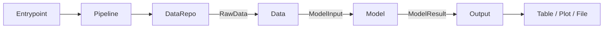

# Model Architecture

An opinionated but framework-neutral baseline for building data-driven models with Python 3.13 and `uv`.

It works for business-rule engines, statistical models, optimization models, forecasting pipelines, simulations, and machine-learning inference. The core package does not depend on a dataframe library, plotting library, database client, or web framework.

## Runtime flow



`Pipeline` is the only object that knows the full workflow:

1. `DataRepo.retrieve()` performs external I/O and returns raw data.
2. `Data.process()` validates and transforms raw data into model-ready input.
3. `Model.run()` applies business logic and returns a typed result.
4. Each `Output.generate()` turns the model result into a presentation artifact.

The `Model` never retrieves data or renders output. This makes business logic deterministic and easy to test.

## Project structure

```text
src/model_architecture/
├── application/        # Pipeline orchestration
├── domain/             # Data and Model contracts
├── ports/              # DataRepo and Output contracts
├── adapters/           # Replaceable repository and output implementations
├── entrypoints/        # CLI, API, worker, or scheduler boundaries
├── examples/           # Executable reference implementation
└── bootstrap.py        # Dependency construction

tests/
├── unit/
└── integration/
```

## Quick start

Install Python 3.13 and create the locked development environment:

```bash
uv python install 3.13
uv sync --dev
```

Run the example pipeline:

```bash
uv run model-architecture-example 10 20 30
```

Run quality checks:

```bash
uv run pytest --cov
uv run ruff check .
uv run ruff format --check .
uv run mypy
```

## Add a new model

1. Define typed `RawData`, `ModelInput`, and `ModelResult` objects for the use case.
2. Implement `DataRepo` for S3, a database, an API, or another source.
3. Implement `Data` to validate and transform raw data.
4. Implement `Model` with business logic only.
5. Implement one or more `Output` adapters, such as a table or plot renderer.
6. Construct those objects in `bootstrap.py` and inject them into `Pipeline`.

Use `typing.Protocol` contracts instead of inheritance-heavy base classes. Objects only need to provide the expected method, which keeps implementations small and easy to replace.

