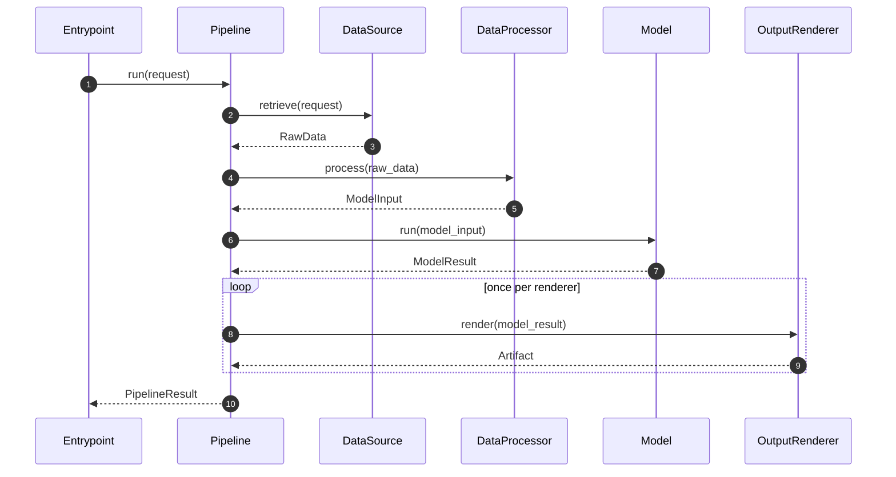
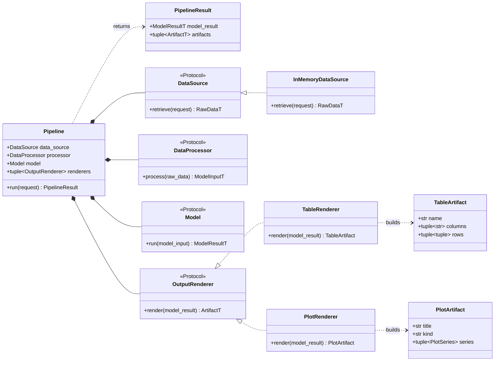
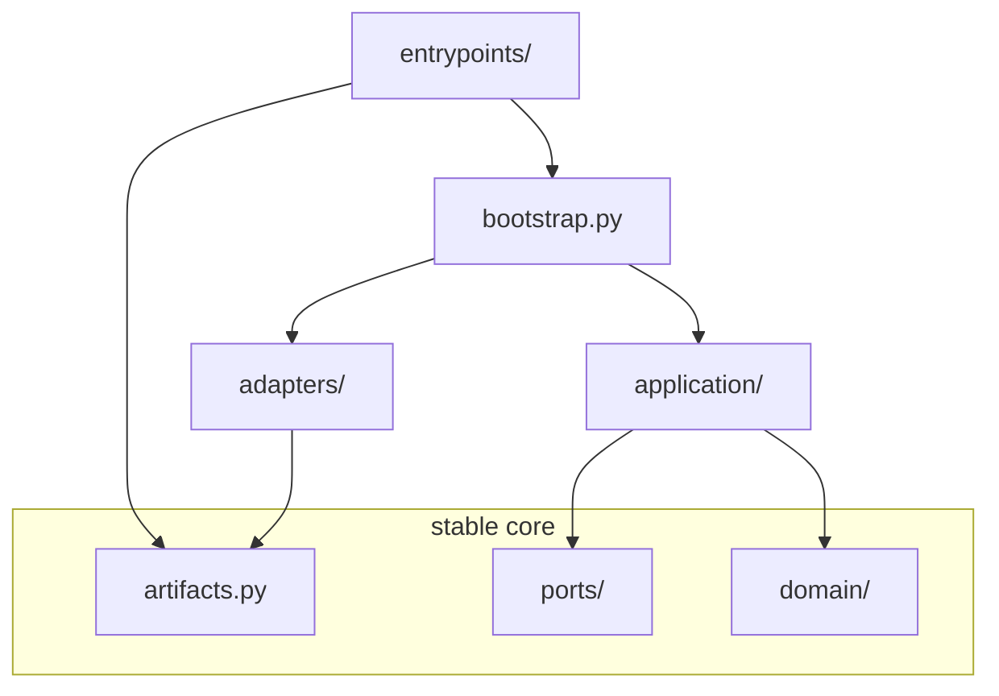

# Model Architecture

[](https://github.com/jooyeongkang/model-architecture/actions/workflows/ci.yml)

An opinionated but framework-neutral baseline for building data-driven models with Python 3.13 and `uv`.

It works for business-rule engines, statistical models, optimization models, forecasting pipelines, simulations, and machine-learning inference. The core package does not depend on a dataframe library, plotting library, database client, or web framework.

## Runtime flow

One call to `Pipeline.run()` drives the whole workflow. Every arrow starts at the pipeline: collaborators never call each other, so each one can be tested and replaced on its own.



1. `DataSource.retrieve()` performs external I/O and returns raw data.
2. `DataProcessor.process()` validates and transforms raw data into model-ready input.
3. `Model.run()` applies business logic and returns a typed result.
4. Each `OutputRenderer.render()` turns the model result into an artifact.

The `Model` never retrieves data or renders output. This makes business logic deterministic and easy to test.

## Object relations

Four single-method protocols, their implementations, and the pipeline that holds them:



The dashed "implements" arrows are **structural**, not inheritance. Nothing subclasses a protocol and no adapter imports one — an object qualifies by having the right method, and `mypy` verifies that where the pipeline is assembled in `bootstrap.py`.

## Layers

One rule decides where a contract lives:

> If it touches the outside world, it is a **port**. Otherwise it is **domain**.

| Package | Role | Holds |
| --- | --- | --- |
| `domain/` | What the application computes | `DataProcessor`, `Model`, errors |
| `ports/` | How it connects to the world | `DataSource`, `OutputRenderer` |
| `adapters/` | Replaceable implementations of ports | `InMemoryDataSource`, `TableRenderer`, `PlotRenderer` |
| `application/` | Orchestration | `Pipeline`, `PipelineResult` |
| `entrypoints/` | Delivery boundaries | CLI, API, worker, scheduler |
| `artifacts.py` | Shared presentation values | `TableArtifact`, `PlotArtifact`, `PlotSeries` |
| `bootstrap.py` | Composition root | Builds and injects collaborators |

Imports only ever point downward, into modules that import nothing back:



Nothing in the stable core imports anything else in the package, so the arrows only ever run one way. (`examples/` is left out above: it is demo code imported by `entrypoints/` and `bootstrap.py`, and it imports only `domain/` and `artifacts.py`.)

Two properties fall out of this. `bootstrap.py` is the only module that names every layer at once, so swapping an adapter is a one-line change there. And artifacts sit at the top level rather than inside `adapters/` because they are the stable currency every layer passes around, not a replaceable implementation detail.

## Project structure

```text
src/model_architecture/
├── domain/             # DataProcessor and Model contracts, errors
├── ports/              # DataSource and OutputRenderer contracts
├── adapters/           # Replaceable data source and renderer implementations
├── application/        # Pipeline orchestration
├── entrypoints/        # CLI, API, worker, or scheduler boundaries
├── examples/           # Executable reference implementation
├── artifacts.py        # Library-neutral tables and plots
└── bootstrap.py        # Dependency construction

tests/
├── unit/          # one collaborator at a time
└── integration/   # whole pipeline, InMemoryDataSource in place of real I/O
```

## Quick start

Install Python 3.13 and create the locked development environment:

```bash
uv python install 3.13
uv sync --dev
```

Run the example pipeline:

```bash
uv run model-architecture-example 10 20 30
```

Run quality checks:

```bash
uv run pytest --cov
uv run ruff check .
uv run ruff format --check .
uv run mypy
```

## Where to define your types

`RawDataT`, `ModelInputT`, and `ModelResultT` are type parameters, bound to concrete types in `bootstrap.py`. Define those concrete types in `domain/`:

| Type | Home | Why |
| --- | --- | --- |
| `Request` | `domain/` | Business vocabulary |
| `RawData` | `domain/` | See the rule below |
| `ModelInput` | `domain/` | Business vocabulary |
| `ModelResult` | `domain/` | Business vocabulary |
| Artifacts | `artifacts.py` | Already there |

Putting them in `domain/` keeps it a leaf that adapters depend on, rather than the reverse. Define one in `adapters/` and your `DataProcessor` ends up importing an adapter.

One rule settles `RawData`, whose shape is otherwise driven by the source:

> Nothing vendor-shaped crosses a port.

A `DataSource` returns a type you own. Raw database tuples and vendor JSON stop inside the adapter, which converts them:

```python
def retrieve(self, request: ChurnRequest, /) -> ChurnRawData:
    vendor_rows: list[tuple[str, int, float]] = cursor.fetchall()
    return ChurnRawData(accounts=tuple(AccountRecord(*row) for row in vendor_rows))
```

The adapter does mechanical deserialization; the `DataProcessor` does validation and feature building. Follow this and swapping Postgres for an API changes one file.

## Add a new model

1. Define typed `RawData`, `ModelInput`, and `ModelResult` objects for the use case.
2. Implement `DataSource` for S3, a database, an API, or another source.
3. Implement `DataProcessor` to validate and transform raw data.
4. Implement `Model` with business logic only.
5. Write a `ModelResult -> Artifact` mapper and wrap it in `TableRenderer` or `PlotRenderer`.
6. Construct those objects in `bootstrap.py` and inject them into `Pipeline`.

Every renderer on one `Pipeline` must agree on a single `ArtifactT`. To emit both a table and a plot from one run, widen the parameter and dispatch on the artifact type in the entrypoint:

```python
Pipeline[ChurnRequest, ChurnRawData, ChurnFeatures, ChurnScores, TableArtifact | PlotArtifact]
```

Use `typing.Protocol` contracts instead of inheritance-heavy base classes. Objects only need to provide the expected method, which keeps implementations small and easy to replace.
